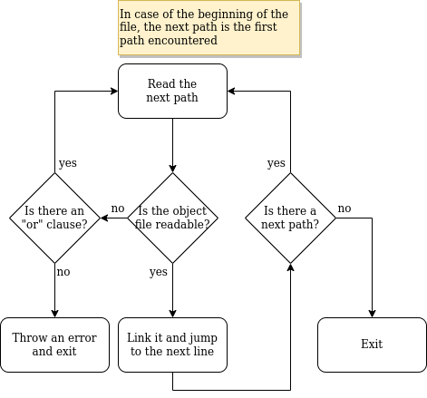

# Link files

A **link file** (or **linkfile**, without space) is a list of paths to object files. The object code in those files is linked with the object code generated by the realizer in order to build the final executable.

An example of a link file's content below.

```
/usr/lib/libc.a or /usr/lib/libc.so or /usr/lib/libc.so.6
/usr/lib/libm.so
/lib/libxcb.a
libmylib.so or ../libmylib.a
```

By looking at it, you may notice:

 - the "or" clause, which states an alternative object file in case the previous one was not found
 - that both *static and shared* object files can be specified and linked
 - that different object files may reside in different directories (relative paths start from the *current working directory*)
 - that paths are separated by a newline character, except when an or clause is present

The link file parsing works as follows:


