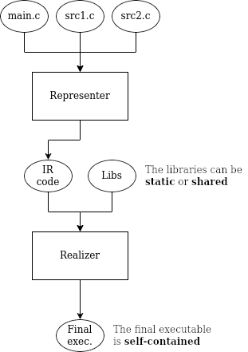

# Compiler structure

The compiler opts for the the [three-stage structure](https://en.wikipedia.org/wiki/Compiler#Three-stage_compiler_structure), with a bit of inspiration taken from [Plan 9 compilers](http://doc.cat-v.org/plan_9/4th_edition/papers/compiler). The whole structure intends to be rather simple than advanced or full-featured. From now on, the term *platform* can be meant as a combination of machine architecture and operating system.

Of the three-stage structure, the first and second stages are delegated to a single entity called **representer**, which takes source code and produces the respective platform-independent IR code. Then, another entity called **realizer** translates IR code into platform-dependent object code and statically links the required libraries, producing the final executable file.

This is an optimal structure: both of the two entities are designed to care about one aspect only. In fact, the representer operates in a platform-*independent* context while the realizer does the opposite.

While there is obviously only one representer, more realizers can exist and each one is specialized in a platform. This is interesting in two ways: the first is that, given any IR code, it does not need to be changed to be compiled by different realizers and the second is that, given a realizer *R* responsible for the architecture *a1* and the operating system *os1* and compiled for the architecture *a2* and the operating system *os2*, *R* can then be used to cross-compile the IR code in *(a2,os2)* for a target platform *(a1,os1)*.

